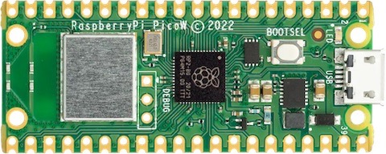
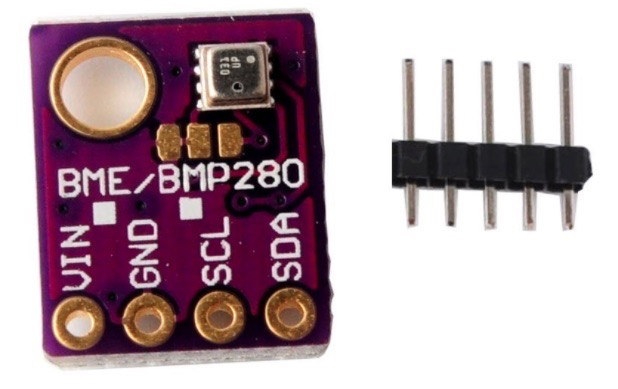
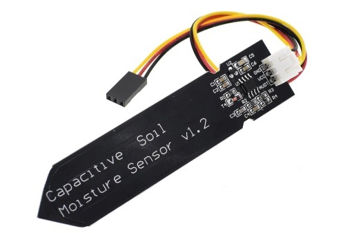
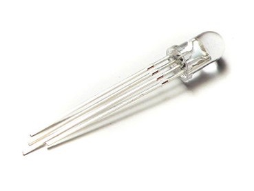

# SmartPlant (Raspberry Pi Pico)

Sistema de monitorización de plantas con Raspberry Pi Pico (MicroPython) para leer humedad del suelo y condiciones ambientales (BME280), representar el estado con LEDs y sincronizar datos con una API. Mismo software para 1 planta (ADC interno), 1–4 plantas (1× ADS1115) y 4–8 plantas (2× ADS1115).

## Resumen del proyecto
- Modos de despliegue: 1 planta (ADC interno), 1–4 plantas (1× ADS1115), 4–8 plantas (2× ADS1115). Ver detalles en [docs/architecture.md](docs/architecture.md)
- Visión general y objetivos: [docs/overview.md](docs/overview.md)

## Funcionalidades clave
- Lectura de humedad del suelo (ADC interno o ADS1115) y normalización de lecturas. Ver [docs/hardware.md](docs/hardware.md) y [docs/architecture.md](docs/architecture.md)
- Medición ambiental con BME280 (temperatura, humedad relativa, presión). Ver [docs/hardware.md](docs/hardware.md)
- Indicadores LED por planta (estado) y de sistema (Power/API). Ver [docs/operation.md](docs/operation.md)
- Sincronización con API: descarga de configuración y envío de datos. Ver [docs/api.md](docs/api.md)
- Enfoque en bajo consumo y escalabilidad 1–8 plantas. Ver [docs/operation.md](docs/operation.md) y [docs/architecture.md](docs/architecture.md)

## Hardware (resumen)
- Raspberry Pi Pico/Pico W, sensor BME280 (I2C), sensor de humedad de suelo (analógico), LEDs de planta y de sistema; opcional ADS1115 (1 o 2). Detalle en [docs/hardware.md](docs/hardware.md) y conexión en [docs/pinout.md](docs/pinout.md)

## Empezar rápido
1. Revisa requisitos e instalación: [docs/setup.md](docs/setup.md)
2. Crea tu env.py desde la plantilla y configura Wi‑Fi/API/DEVICE_ID: [docs/env.md](docs/env.md)
3. Conecta el hardware según: [docs/pinout.md](docs/pinout.md) y [docs/hardware.md](docs/hardware.md)
4. Copia la carpeta src/ a tu Raspberry Pi Pico y reinicia

## Documentación
- Índice general: [docs/index.md](docs/index.md)
- Visión general: [docs/overview.md](docs/overview.md)
- Requisitos e instalación: [docs/setup.md](docs/setup.md)
- Hardware y pinout: [docs/hardware.md](docs/hardware.md), [docs/pinout.md](docs/pinout.md)
- Arquitectura y operación: [docs/architecture.md](docs/architecture.md), [docs/operation.md](docs/operation.md)
- API y entorno: [docs/api.md](docs/api.md), [docs/env.md](docs/env.md)
- Hoja de ruta: [docs/roadmap.md](docs/roadmap.md)

## Galería de hardware
(Referencias visuales de los componentes principales)

## Proyecto
- Sitio del autor: [https://raupulus.dev](https://raupulus.dev)
- Repositorio: [https://gitlab.com/raupulus/rpi-pico-smartplant-gadget](https://gitlab.com/raupulus/rpi-pico-smartplant-gadget)
- Licencia: GPLv3 (ver [LICENSE](LICENSE))

## Estado y roadmap
- Estado actual: fase de diseño/organización. Consulta [docs/roadmap.md](docs/roadmap.md) para las fases previstas
