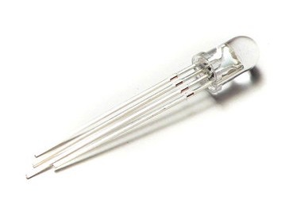

# Hardware y Conexiones

## Componentes principales
- Microcontrolador: Raspberry Pi Pico (RP2040)
- Sensor de humedad del suelo: Sensor capacitivo resistente a la corrosión (GND, VCC, A0)
- Sensor ambiental: Bosch BME280 (temperatura, humedad relativa, presión atmosférica) por I2C
- Indicadores de planta: LEDs por planta
- LEDs de sistema: Encendido y Comunicación API
- Conectores: JST para conexiones modulares

Imágenes de referencia:

## Configuraciones por número de plantas

### 1 planta (ADC interno)
- LEDs por planta: 3 (Rojo/Verde/Azul)
- Sensor de humedad: ADC interno de la Pico
- Conectores JST típicos:
  - 4 pines I2C (VCC, GND, SDA, SCL)
  - 3 pines sensor analógico (VCC, GND, A0)
  - 5 pines LEDs de planta (GND, R, G, B, VCC)
  - 3 pines LEDs de sistema (GND, Power, API, VCC)

### 1–4 plantas (ADS1115)
- LEDs por planta: 2–3 según diseño (recomendado 2: Verde/Rojo)
- ADC externo: ADS1115 (16 bits) por I2C
- Conectores JST típicos:
  - 4 pines I2C principal (VCC, GND, SDA, SCL)
  - 3 pines por sensor (hasta 4 por ADS1115)
  - 4–5 pines por planta para LEDs
  - 3 pines LEDs de sistema

### 4–8 plantas (doble ADS1115)
- LEDs por planta: 2 (Verde/Rojo)
- 2× ADS1115 por I2C
- Conectores JST típicos:
  - 4 pines I2C principal (VCC, GND, SDA, SCL)
  - 3 pines por sensor (hasta 4 por ADS1115)
  - 4 pines por planta para LEDs
  - 3 pines LEDs de sistema

## Componentes de sistema
- LED Encendido: indica que el microcontrolador funciona
- LED Comunicación API: actividad de red (envíos/descargas)
- Monitorización de batería: divisor de tensión (opcional)
- Panel solar: módulo 80×50mm o 50×30mm (opcional)
- Batería 500mah (opcional, en bajo consumo)

Consulta el pinout en [pinout.md](pinout.md) para la asignación detallada de pines por configuración.

---

## Ejemplos de conexión

### Divisor de tensión (monitorización de batería)

Fórmula: Vout = Vin × R2 / (R1 + R2). Conecta la batería a Vin, R1 en serie hasta el nodo de medida (al ADC), R2 desde ese nodo a GND. Añade un condensador de 0.1–1 µF entre el nodo y GND para estabilizar.

- Li‑ion 3.7 V (máx. 4.2 V):
  - **Alta precisión (recomendado)**: R1 = 47kΩ, R2 = 120kΩ → factor ≈ 0.719. A 4.2 V ⇒ ~3.02 V en ADC. Aprovecha ~92% del rango ADC para máxima resolución.
  - Ejemplo seguro: R1 = 100kΩ, R2 = 100kΩ → Vout ≈ Vin × 0.5. A 4.2 V ⇒ ~2.1 V en ADC.
  - Alternativa baja corriente: R1 = 220kΩ, R2 = 100kΩ → factor ≈ 0.3125. A 4.2 V ⇒ ~1.31 V.
  - Nota: Calibra en firmware aplicando el factor inverso.

- Batería 12 V (hasta ~14.4 V en carga):
  - **Ejemplo recomendado (alta precisión)**: R1 = 180kΩ, R2 = 47kΩ → factor ≈ 47/(180+47) ≈ 0.207. A 14.4 V ⇒ ~2.98 V (< 3.3 V). Aprovecha ~90% del rango ADC.
  - Alternativa conservadora: R1 = 100kΩ, R2 = 22kΩ → factor ≈ 0.18. A 14.4 V ⇒ ~2.59 V.
  - Usa resistencias altas para minimizar consumo y protege siempre el ADC de superar 3.3 V.

**Ventajas alta precisión vs. configuración conservadora:**
- **50% más resolución** al aprovechar mejor el rango del ADC (12 bits = 4095 cuentas)
- **Mejor detección** de cambios pequeños en voltaje de batería
- **Consumo adicional mínimo**: ~11µA extra en Li-ion (despreciable vs. consumo total sistema)
- **Indicación más precisa** del estado real de carga de la batería

### LEDs individuales (1.5 mm, 3 mm y 5 mm) a 3.3 V

Fórmula general: R = (Vcc − Vf) / I. Valores típicos (indicadores, bajo consumo):
- 1.5 mm: 1 kΩ – 2.2 kΩ
- 3 mm: 680 Ω – 1 kΩ
- 5 mm: 330 Ω – 680 Ω

Referencias de Vf típicas: Rojo ≈ 1.8–2.2 V, Verde ≈ 2.0–3.0 V, Azul ≈ 2.8–3.3 V. Ejemplo: LED rojo (Vf 2.0 V) a 5 mA ⇒ (3.3−2.0)/0.005 ≈ 260 Ω → usar 270–330 Ω; para menor consumo, 680 Ω – 1 kΩ.

Cableado: GPIO → Resistencia en serie → Ánodo LED; Cátodo → GND (o inverso si se utiliza lógica activa-baja).

### LED RGB de 4 patillas

Si prefieres un LED RGB común en lugar de 3 LEDs individuales, puedes usar:
- Rojo: 680 Ω
- Azul: 680 Ω
- Verde: 20 kΩ (para reducir brillo y consumo)

Notas:
- Comprueba si es cátodo común (común a GND) o ánodo común (común a Vcc) y cablea en consecuencia. Cada canal debe llevar su resistencia en serie.
- La opción de LEDs individuales sigue siendo totalmente válida y soportada.
- Estos valores son orientativos en base a los que yo he probado. Hay muchos 
  otros valores posibles en base a los que tú vayas a usar y deberías 
  calibrarlos en tu propio proyecto.

### Control de actuadores (bomba de agua e iluminación) – opcional

Para accionar una bomba de agua o la iluminación interior desde la Pico, utiliza un GPIO como salida conectado a un módulo de relé o a un transistor MOSFET de nivel lógico (3.3 V):
- Relé: módulos con optoacoplador y disparo a bajo nivel suelen funcionar bien. Alimenta el relé desde 5 V (según módulo) y comparte GND con la Pico. El GPIO controla IN del módulo.
- MOSFET (recomendado para cargas DC): N‑MOSFET canal N de nivel lógico (p. ej., IRLZ44N u otro apto a 3.3 V). Cableado típico low‑side: GPIO → resistencia 220–1 kΩ → Gate; Source → GND; Drain → negativo de la carga; positivo de la carga → V+ batería/fuente. Añade diodo flyback en cargas inductivas (bomba, relé) en antiparalelo.
- Seguridad: separa alimentación de cargas de la lógica, usa fusible adecuado, dimensiona cables y nunca superes las especificaciones del módulo.

Pines sugeridos (ver detalles en pinout.md):
- 1 planta: GPIO 21 → Bomba (opcional), GPIO 22 → Luz interior (opcional).
- 8 plantas: GPIO 0 → Bomba (opcional), GPIO 1 → Luz interior (opcional).

### Entrada de señal externa a GPIO (trigger) – opcional

Si quieres que una señal externa active funciones (p. ej., forzar encendido de luz o riego), conéctala a un GPIO configurado como entrada:
- Niveles: la Pico trabaja a 3.3 V. Si la señal externa es 5/12 V, adapta con divisor resistivo u optoacoplador.
- Pull‑ups/pull‑downs: usa Pin.PULL_UP o Pin.PULL_DOWN según el esquema. Ejemplo (contacto seco a GND): habilita PULL_UP y el contacto cierra a tierra para leer LOW.
- Protección: añade resistencia en serie 1–10 kΩ y considera filtrado RC o software (debounce) si hay rebotes.

### Sensor de nivel de agua (boya) – opcional

Un sensor tipo boya funciona como un interruptor (normalmente abierto o cerrado):
- Cableado típico (NO a GND): GPIO configurado como entrada con PULL_UP; el otro terminal de la boya a GND. Cuando hay agua y la boya cierra, el pin lee LOW.
- Alternativa (a Vcc): usar PULL_DOWN y conectar el otro terminal a 3.3 V; el pin leerá HIGH al cerrar.
- Estabilización/ruido: recomienda un condensador pequeño (10–100 nF) y/o debounce por software para evitar falsos cambios por vibraciones.
- Seguridad: si el depósito controla el motor de riego, corta el riego cuando el nivel indique “bajo”.

Pines sugeridos (ver detalles en pinout.md):
- 1 planta: GPIO 23 (recomendado para evitar conflictos con LED API en GPIO 20). Configurable vía WATER_LEVEL_SENSOR_PIN.
- 8 plantas: GPIO 2 (opcional y libre en el esquema propuesto).

### Monitorización de batería con ADC interno – opcional

Conecta la batería mediante un divisor de tensión al ADC interno para calcular el porcentaje:
- ADC disponibles: ADC0=GPIO26, ADC1=GPIO27, ADC2=GPIO28.
- Ejemplo 1 planta: usar GPIO 27 (ADC1) como en el pinout.
- Dimensiona el divisor para no superar 3.3 V en el ADC y calibra en firmware para convertir a voltaje real y porcentaje.

Consulta arriba “Divisor de tensión (monitorización de batería)” para ejemplos de valores.

### Enlaces relacionados
- Asignación de pines: [pinout.md](pinout.md)
- Semántica de LEDs y ciclos: [operation.md](operation.md)
- Arquitectura general: [architecture.md](architecture.md)
- Comunicación con API: [api.md](api.md)
